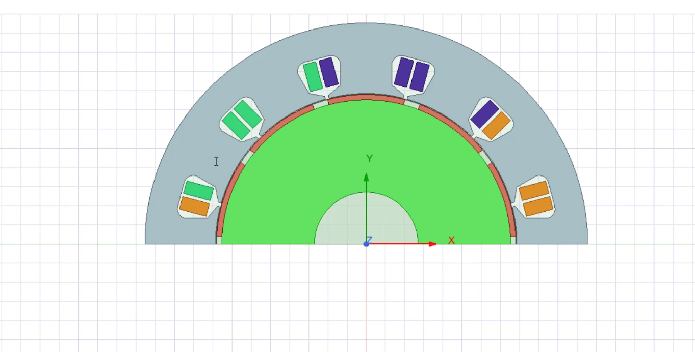

# MotorDesignSPMSM
## Summary
This program is based on AEDT to design a factional and concentrated winding motor.

## Inputs
The inputs are in run.py:

Specifications = {

    'Qs': 16,

    'Poles': 12,

    'DiaYoke': 400,

    'Length': 300,

    'RatedPower': 60e3,

    'Speed': 2500,

    'VDC': 400,

    'J': 7.5
}

Where,
* Qs, is the slot number
* Poles, Poles number 
* DiaYoke, machine outer diameter
* Length, efective machine length
* RatedPower, Machine power rated
* Speed, Constant speed
* VDC, Available DC voltage
* J, current density allowed in the windings

## Refereces

This work is basede on: [Mark Weng's Work](https://github.com/MarkWengSTR/ansys-maxwell-EM-design-online)